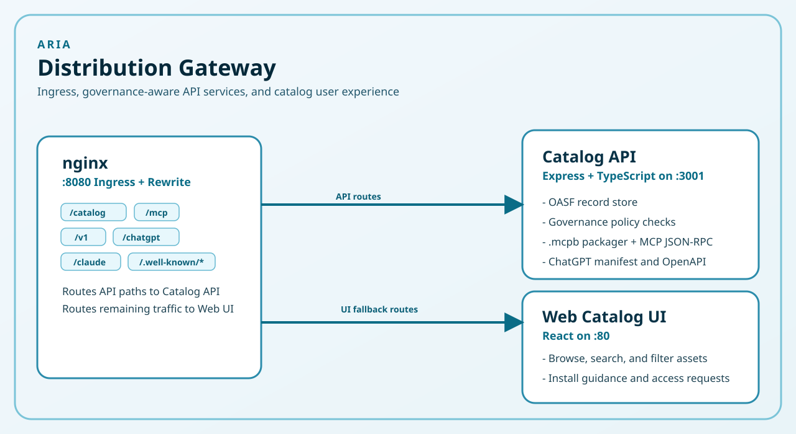
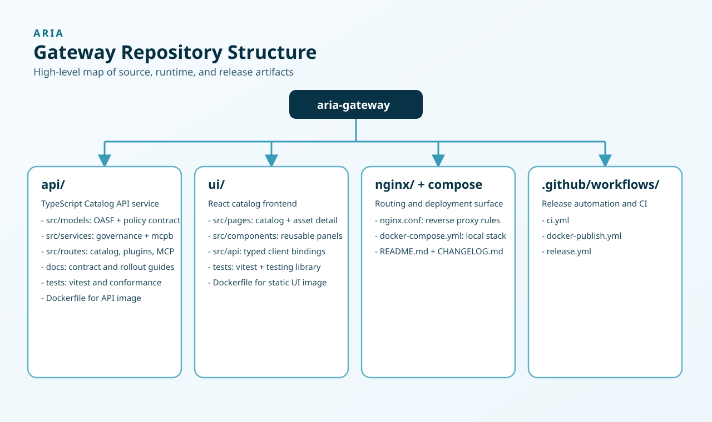

# ARIA Distribution Gateway

> **Distribution gateway and catalog API for ARIA-compliant AI assets.**
> Provides a governed, browsable marketplace endpoint for AI platforms like Claude Desktop, ChatGPT, and VS Code.

[](https://github.com/aria-fx/aria-gateway/actions/workflows/ci.yml)
[](https://github.com/aria-fx/aria-gateway/actions/workflows/docker-publish.yml)

---

## What is this?

The ARIA Distribution Gateway is the "last mile" delivery layer for the [ARIA Asset Registry for Intelligent Agents](https://github.com/aria-fx/aria) framework.

It translates governed OCI artifacts stored in the ARIA marketplace into platform-native install experiences:

| Platform | Experience |
|----------|-----------|
| **Claude Desktop** | Browse and add skills via MCP server integration |
| **ChatGPT / GPT Actions** | Catalog appears as a plugin via OpenAPI spec |
| **VS Code** | Skills install into `.vscode/mcp.json` via config snippet |
| **Web Browser** | Non-technical users browse and install from the catalog UI |

---

## Quick Start

### Using Docker Compose (recommended)

```bash
git clone https://github.com/aria-fx/aria-gateway
cd aria-gateway
docker compose up -d
```

Open **http://localhost:8080** to browse the catalog.

| Service | URL |
|---------|-----|
| Web Catalog UI | http://localhost:8080 |
| Catalog API | http://localhost:8080/catalog/assets |
| MCP Server (Claude) | http://localhost:8080/mcp |
| ChatGPT Plugin | http://localhost:8080/.well-known/ai-plugin.json |
| OpenAPI Spec | http://localhost:8080/openapi.json |

### Local development

```bash
# Start the API
cd api && npm install && npm run dev
# API running at http://localhost:3001

# Start the UI (in another terminal)
cd ui && npm install && npm run dev
# UI running at http://localhost:5173
```

---

## Integration Guides

### Claude Desktop

Add the ARIA catalog as an MCP server in Claude Desktop:

1. Open Claude Desktop → **Settings → Developer → Edit Config**
2. Add to `claude_desktop_config.json`:

```json
{
  "mcpServers": {
    "aria-gateway": {
      "url": "http://your-gateway-host/mcp",
      "headers": {
        "Authorization": "Bearer <your_entra_jwt>"
      }
    }
  }
}
```

3. Restart Claude Desktop. Type `@aria-gateway` in any conversation to search and install skills.

Available MCP tools:
- `search_assets` — find skills by keyword or department
- `get_asset_detail` — get details about a specific skill
- `install_asset` — get step-by-step installation instructions

### ChatGPT / GPT Actions

1. In the GPT editor, select **Create new action**
2. Set the OpenAPI URL to: `https://your-gateway-host/openapi.json`
3. Or point to the plugin manifest: `https://your-gateway-host/.well-known/ai-plugin.json`
4. In the **Authentication** step, select **API Key → Bearer** and provide your Entra JWT.

ChatGPT will be able to search the catalog and help users install skills.

### VS Code (GitHub Copilot MCP)

Skills from the catalog install directly into VS Code by adding to `.vscode/mcp.json`:

```json
{
  "servers": {
    "skill-name": {
      "type": "stdio",
      "command": "npx",
      "args": ["-y", "@aria-fx/skill-name@version"]
    }
  }
}
```

The "Add to VS Code" button on the catalog UI generates this snippet automatically.

---

## Architecture



### URL Rewrite Rules (nginx)

| Incoming URL | Routes to | Notes |
|-------------|-----------|-------|
| `/.well-known/ai-plugin.json` | Catalog API | ChatGPT plugin manifest |
| `/.well-known/openapi.yaml` | Catalog API | OpenAPI spec (alias) |
| `/openapi.json` | Catalog API | OpenAPI spec |
| `/mcp`, `/mcp/*` | Catalog API | Claude Desktop MCP endpoint |
| `/catalog/*` | Catalog API | Direct API access |
| `/v1/*` | Catalog API | Versioned alias (`/v1/assets` → `/catalog/assets`) |
| `/chatgpt/*` | Catalog API | ChatGPT-tagged requests |
| `/claude/*` | Catalog API | Claude Enterprise-tagged requests |
| `/` and everything else | Web UI | React SPA |

---

## Catalog API Reference

All endpoints are under `/catalog/`. Requests tagged from AI platforms via nginx headers.

### Authentication

The gateway supports two authentication modes:

#### Bearer Token (recommended)

Supply an Entra (Azure AD) JWT bearer token in the `Authorization` header:

```http
Authorization: Bearer <entra_jwt>
```

**Obtaining a token** (client-credentials flow):

```bash
curl -X POST "https://login.microsoftonline.com/${TENANT_ID}/oauth2/v2.0/token" \
  -d "grant_type=client_credentials" \
  -d "client_id=${CLIENT_ID}" \
  -d "client_secret=${CLIENT_SECRET}" \
  -d "scope=api://${ENTRA_AUDIENCE}/.default"
```

The token's `roles` claim controls the sensitivity ceiling:

| Role | Sensitivity ceiling |
|------|---------------------|
| `aria-gateway-admin` | `highly_confidential` |
| `aria-gateway-confidential` | `confidential` |
| `aria-gateway-internal` | `internal` (default for authenticated users) |

**Example — list assets with a bearer token:**

```bash
curl https://your-gateway-host/catalog/assets \
  -H "Authorization: Bearer ${TOKEN}"
```

Set `AUTH_ENFORCE=true` on the gateway to require a valid token on every request.

> **Auth runbook:** For a step-by-step guide to issuing Entra tokens and safely enabling enforce mode, see [`api/docs/auth-migration-runbook.md`](api/docs/auth-migration-runbook.md).

> ~~**Legacy Consumer Headers**~~ — Header-based identity (`X-Consumer-Id` / `X-Sensitivity-Ceiling`) has been **removed** in v2.0.0.  All callers must use JWT bearer tokens.  Unauthenticated requests receive a `public`-only access context.

> **Policy Contract:** The identity, access, and decision types used internally are defined in the versioned Auth-Core Policy Contract.  See [`api/docs/policy-contract.md`](api/docs/policy-contract.md) for the full contract specification, versioning strategy, and IDP extension points.

### Endpoints

| Method | Path | Description |
|--------|------|-------------|
| `GET` | `/catalog/assets` | List all assets you're authorized to see |
| `GET` | `/catalog/assets?q=hr&domain=human_resources&page=1&pageSize=25` | Search/filter assets with pagination |
| `GET` | `/catalog/assets/{name}/versions` | List versions of an asset |
| `GET` | `/catalog/assets/{name}/{version}/manifest` | Full OASF record + governance overlay |
| `GET` | `/catalog/assets/{name}/{version}/mcpb` | Download `.mcpb` bundle for Claude Desktop |
| `POST` | `/catalog/assets/{name}/{version}/install` | Submit async install request (`202` with `installId`, `status`, `estimatedReadyAt`) |
| `POST` | `/catalog/assets/{name}/{version}/request-access` | Submit access request (`202` when submitted, `400` when already authorized) |
| `POST` | `/catalog/cache/refresh` | Force-refresh catalog metadata cache (bypasses TTL) |
| `GET` | `/catalog/stats` | Catalog summary statistics |

### Catalog metadata freshness policy

- Registry-backed catalog metadata uses a TTL cache (`CATALOG_CACHE_TTL_SECONDS`, default `300` seconds).
- The staleness window target is equal to the cache TTL and is exposed as `catalog_cache.staleness_window_seconds` on `GET /metrics`.
- Freshness SLA target is `CATALOG_FRESHNESS_SLA_P95_SECONDS` (default `300` seconds) and is measured via `catalog_cache.p95_freshness_seconds`.
- Publish/remove workflows can trigger explicit invalidation by calling `POST /catalog/cache/refresh`.

### Governance

Every request is checked against the OASF governance overlay:

1. **Sensitivity ceiling** — asset tier ≤ consumer ceiling
2. **Consumer allow-list** — consumer identity in `allowed_consumers`
3. **Dependency ceiling** — recursive dependency check

If blocked, governed endpoints return `403` with a structured reason payload and an `action_url` to request access.

---

## Sensitivity Tiers

| Tier | Who can see it | Example |
|------|----------------|---------|
| `public` | Everyone (including AI platforms) | Code review skill |
| `internal` | All employees | HR policy lookup |
| `confidential` | Specific teams with approval | Onboarding assistant |
| `highly_confidential` | Restricted to named consumers | Financial analyzer |

---

## Project Structure



---

## Running Tests

```bash
# API tests (Vitest + Supertest)
cd api && npm test

# UI tests (Vitest + Testing Library)
cd ui && npm test

# With coverage
cd api && npm run test:coverage
```

---

## Docker Images

Published to GitHub Container Registry on every merge to `main`:

| Image | Description |
|-------|-------------|
| `ghcr.io/aria-fx/aria-gateway-api:latest` | Catalog API |
| `ghcr.io/aria-fx/aria-gateway-ui:latest` | Web Catalog UI |

Images are built for `linux/amd64` and `linux/arm64`.

---

## Environment Variables

### API (`api/`)

| Variable | Default | Description |
|----------|---------|-------------|
| `PORT` | `3001` | API server port |
| `API_BASE_URL` | `http://localhost:3001` | Public base URL (used in manifests) |
| `CORS_ORIGIN` | `*` | CORS allowed origins |
| `NODE_ENV` | `development` | Environment mode |
| `OCI_REGISTRY` | `ghcr.io/aria-fx/aria-assets` | OCI registry for `.mcpb` packages |
| `AUTH_ENFORCE` | `false` | Set to `true` to reject requests with missing/invalid tokens |
| `ENTRA_TENANT_ID` | — | Azure AD tenant ID (builds issuer + JWKS URLs automatically) |
| `ENTRA_AUDIENCE` | — | Expected `aud` claim (app/client ID or URI) |
| `LEGACY_HEADERS_MODE` | `enabled` | Set to `disabled` to reject header-only requests |
| `CATALOG_PROVIDER` | `registry` | Catalog data source: `registry` to pull from an OCI registry, `sample` to serve built-in sample assets |
| `CATALOG_SAMPLE_MODE` | `false` | Set to `true` to activate sample data when `CATALOG_PROVIDER=sample`; also enables registry-to-sample fallback in dev/test |
| `CATALOG_REGISTRY_URL` | `https://ghcr.io` | OCI registry base URL for catalog assets |
| `CATALOG_REGISTRY_REPOSITORY` | `aria-fx/aria-assets` | Repository path within the registry |
| `CATALOG_REGISTRY_REFERENCE` | `latest` | Tag or digest to fetch from the registry |
| `CATALOG_REGISTRY_TOKEN` | — | ****** or Personal Access Token (PAT) for authenticating to the catalog registry |
| `CATALOG_CACHE_TTL_SECONDS` | `300` | Registry metadata cache TTL and staleness window (seconds) |
| `CATALOG_FRESHNESS_SLA_P95_SECONDS` | `300` | Target p95 freshness SLA (seconds) for cache observations |

### UI (`ui/`)

| Variable | Default | Description |
|----------|---------|-------------|
| `VITE_API_URL` | `/catalog` | Catalog API base URL (build-time; passed as a Docker build arg in `docker-compose.yml`) |

---

## Contributing

This project follows the [ARIA framework specification](https://github.com/aria-fx/aria). OASF record structure, governance overlay format, and lifecycle states are defined in the ARIA reference architecture.

---

## License

MIT
